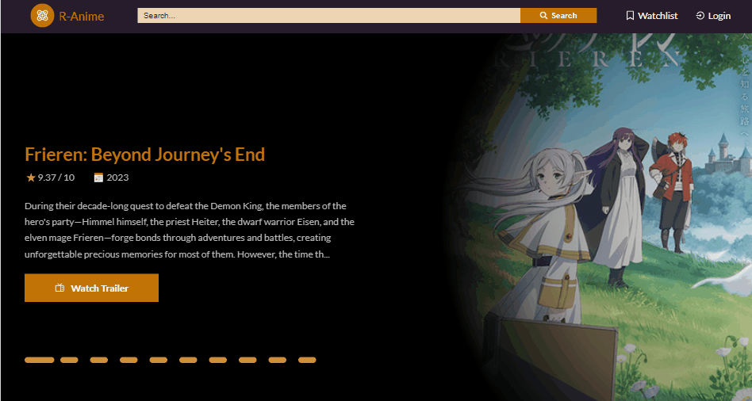
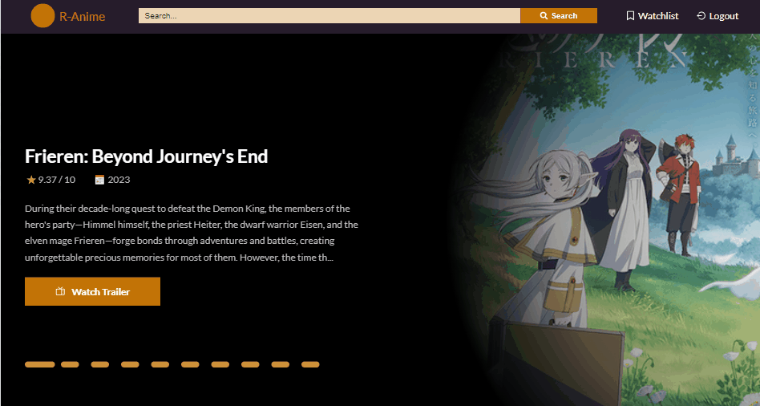

# R-Anime

[View Demo here](https://r-anime.onrender.com)

An anime application built with React JS for the frontend and Express JS and Mongoose for the backend by using [Jikan REST API](https://docs.api.jikan.moe/).The user can search for anime movies and series and filter the search based on certain values. The user can also see details about the anime, such as anime characters, voice actors, anime reviews, anime episodes and summaries. Additionally, after logging in, the user can add any anime they want to the watchlist. I created a [REST API](https://github.com/Tanju67/react-anime-backend.git) for the backend of this application.

⛔ Jikan API let me to send 3 request per second. Therefore please wait for at least 1 second or the page upload before refreshing the page or navigating other page.

1. UserCredential:
   - email:test@mail.com
   - password:secret123


## Features

### Sign In & Sign Out

The user must log in to add the anime to the watchlist.  


### Search Anime

Users can search anime data by writing the name of the anime and filter by cahnging max score ,min score,type and status values.


### See Anime Detail

Users can see the detail of animes such as anime trailer, characters, voice actors, reviews, anime news and related animes. Users can also jump to a detail page of characters and voice actors. For anime series, users can see all seasons and episodes' details.


## Built With

- React JS
- Redux Tool Kit
- React Router
- CSS Modules

## Getting Started

### Prerequisites

Install npm.

- npm
  ```
  npm install npm@latest -g
  ```
- You must clone [the backend repo](https://github.com/Tanju67/react-anime-backend.git) of this application.
  ```
  git clone https://github.com/Tanju67/react-anime-backend.git
  ```

### Installation

1. Clone the repo.
   ```
   git clone https://github.com/Tanju67/react-anime-frontend.git
   ```
2. Install NPM packages.
   ```
   npm install
   ```
3. Create the backend url in a .env file.
   ```
   VITE_BACKEND_URL=your backend url
   ```
4. Start the frontend server (Firstly you must start backend server).
   ```
   npm run dev
   ```
